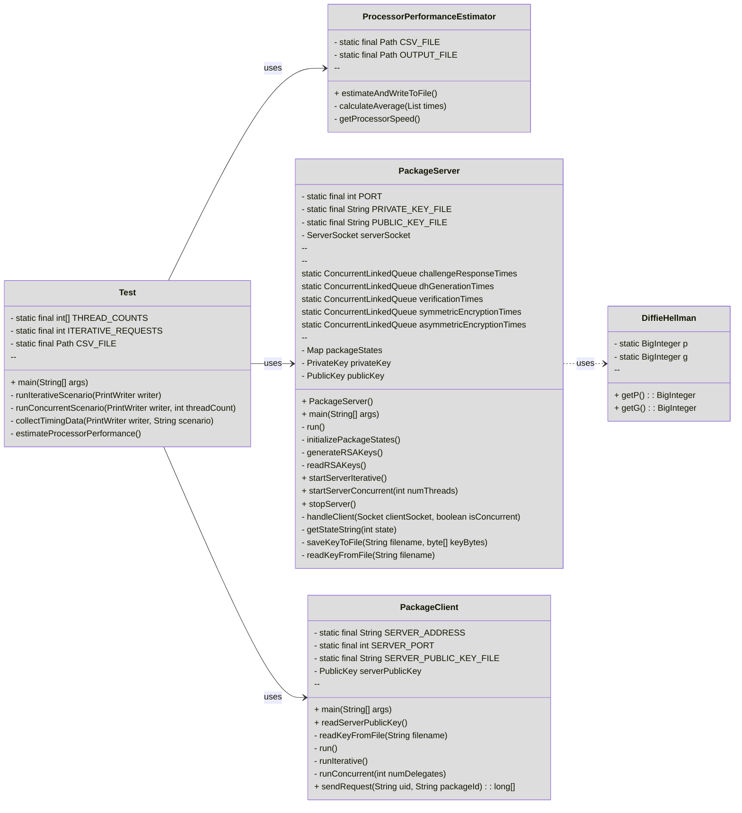

## Introduction
The Secure Package Tracking System is a Java-based application designed to simulate a secure communication protocol between a client and a server for tracking package statuses. It emphasizes cryptographic techniques to ensure confidentiality, integrity, and authentication during data exchange.

## Features
- **Secure Communication Protocol**: Implements a custom protocol using RSA, Diffie-Hellman key exchange, AES encryption, and HMAC for authentication and data integrity.
- **Iterative and Concurrent Modes**: Supports both iterative (single-threaded) and concurrent (multi-threaded) server operation modes.
- **Performance Testing**: Includes a test suite to measure the performance of cryptographic operations under different scenarios.
- **Processor Performance Estimation**: Estimates processor speed and encryption operations per second based on collected data.
- **Detailed Logging**: Provides comprehensive console output for each step, including timing data for cryptographic operations.

## UML

## Protocol
Handling Client Connections

The handleClient method performs the protocol steps with the client.

### Key Steps:

1. Step 1: Receive "SECINIT" from the client.
2. Step 2b & 3: Receive encrypted challenge and decrypt it using the server's private key.
3. Step 4: Send the decrypted challenge back to the client.
4. Step 5: Receive "OK" or "ERROR" from the client.
5. Step 7: Generate Diffie-Hellman parameters G, P, G^x.
6. Step 8: Send parameters and signature to the client.
7. Step 10: Receive "OK" or "ERROR" from the client.
8. Step 11b: Compute shared secret and derive session keys.
9. Step 12: Receive IV from the client.
10. Step 13 & 14: Receive encrypted uid and package_id, verify HMACs, and decrypt them.
11. Step 15: Look up the package state.
12. Step 16: Encrypt the state and send it with HMAC.
13. Additional: Measure and print the timings for various operations.

### Key Generation and Encryption
1. Diffie-Hellman Parameters: Use p and g from OpenSSL.
2. Master Key: Compute shared secret using gy.modPow(x, p).
3. Session Keys: Derive from SHA-512 digest of the master key.
   
### Measuring Encryption Times
1. Symmetric Encryption: Measure time to encrypt the state using AES.
2. Asymmetric Encryption: Measure time to encrypt the state using RSA.

### Sending and Receiving Data
- IV: Receive 16-byte IV from the client.
- HMAC Verification: Verify HMACs for uid and package_id.
- Encryption and HMAC: Encrypt the state and compute its HMAC before sending.
